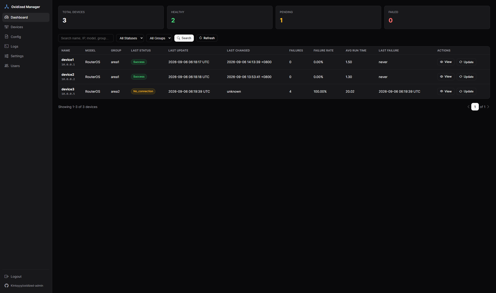
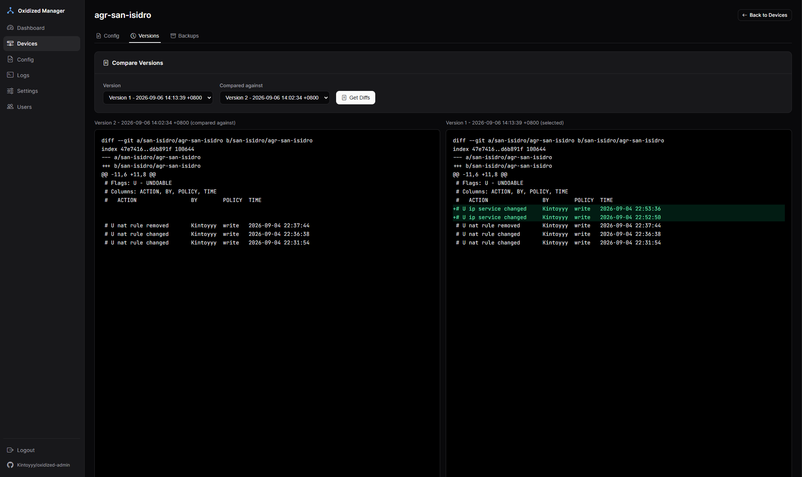

# Oxidized

A NOC dashboard for managing [Oxidized](https://github.com/ytti/oxidized) configuration backups, with optional [LibreNMS](https://www.librenms.org) device sync, backup history, and multi-user support.

## Features

- Real-time device status via the Oxidized REST API
- Config backup, editing, and restore with retention policy
- Device inventory with grouping (organize by site/customer)
- SSH connection testing before adding a device (requires `paramiko`)
- Optional GitHub push for off-site backups + version control (requires `GitPython`)
- Optional LibreNMS integration — auto-sync devices, pull alerts (the app is fully standalone without it)
- Multi-user support with roles (admin/operator) and audit logging
- REST API for integrations





## Requirements

- Ubuntu 22.04+ / Debian 11+
- Python 3.8+
- Oxidized 0.28.0+ (the installer sets this up if it's missing)

## Installation

The installer must be run as root — it creates a dedicated `oxidized` system user, installs Oxidized under it, and then installs the admin page.

```bash
git clone https://github.com/Kintoyyy/oxidized-admin
cd oxidized-admin
chmod +x install_oxidized_manager.sh
sudo ./install_oxidized_manager.sh
```

Or, without cloning first:

```bash
sudo bash -c "$(curl -fsSL https://raw.githubusercontent.com/Kintoyyy/oxidized-admin/refs/heads/main/install_oxidized_manager.sh)"
```

You'll be prompted for the admin page install directory, Oxidized config directory, and admin username/password/email (the admin page always runs on port 5000 internally). The script then:

1. Detects any existing Oxidized install — you can **skip** it (leave as-is), **nuke** it (reinstall the gems fresh, keeping existing backups/config), or cancel.
2. If installing, creates the `oxidized` system user, grants it passwordless sudo, installs build dependencies, and installs the `oxidized`/`oxidized-web`/`oxidized-script` gems.
3. Sets up an `oxidized.service` systemd unit running as that user, and restricts Oxidized's REST/web interface (port 8888) to `127.0.0.1` — the admin page always talks to it over localhost, so it's never exposed by default (see [Securing the Oxidized Web GUI](#securing-the-oxidized-web-gui) to expose it deliberately).
4. Optionally installs Nginx as a reverse proxy for the **admin page** on port 80 (recommended — lets you reach it at `http://<host>/` instead of `http://<host>:5000`). When this is enabled, gunicorn is bound to `127.0.0.1:5000` and port 5000 is not opened in the firewall — Nginx is the only way in. If you decline, the admin page falls back to a direct wildcard bind on port 5000 instead, so it stays reachable.
5. Separately offers to expose the Oxidized web GUI itself on port 8888 via Nginx, password-protected by default. If you say LibreNMS needs it (its built-in Oxidized widget talks to the REST API directly and doesn't support basic auth), the installer also allowlists just the LibreNMS host's IP to skip the password — everyone else still needs one (see [Securing the Oxidized Web GUI](#securing-the-oxidized-web-gui)).
6. Always does a fresh `git clone` of this repo and overwrites the admin page files (`oxidized_nms_manager.py`, `requirements.txt`, any `.html` templates) in the install directory, initializes the database, and sets up the `oxidized-manager.service` systemd unit.

That last step means **re-running the installer is also how you update the admin page** — it always pulls the latest code from git and replaces what's deployed, regardless of local edits (Settings also has an **Update to Latest Version** button that does the same pull-and-restart without a full re-run, and shows the currently deployed commit hash so you can tell what's actually running). The Oxidized config file itself is left alone unless you choose "Nuke". Re-running it also cleans up sites left behind by older versions of this installer (see [Troubleshooting](#troubleshooting) if you're upgrading from one and port 80 is misbehaving).

Open `http://<host>/` (or `http://<host>:5000` if you declined the Nginx step) and log in with the admin credentials you set.

### Manual install

```bash
python3 -m venv venv
source venv/bin/activate
pip install -r requirements.txt
python3 oxidized_nms_manager.py
```

## Configuration

Environment variables (set in the systemd unit or shell):

```bash
OXIDIZED_CONFIG_DIR   # default: /home/oxidized/.config/oxidized
APP_DB_PATH           # default: /home/oxidized/.oxidized_manager/app.db
APP_NAME              # default: "Oxidized Manager"
PORT                  # default: 5000
SECRET_KEY            # set a real value in production
DEBUG                 # default: False
```

- **LibreNMS (optional):** Settings → enter LibreNMS URL + API token → enable sync. Devices can also always be added manually.
- **GitHub backups (optional):** Settings → GitHub Integration → repo URL + personal access token (`repo` scope) + branch → enable. See [Backing Up to GitHub](#backing-up-to-github) for full setup steps.
- **Device groups:** Settings → Manage Groups → create groups to organize devices, with optional default credentials per group.

### Backing Up to GitHub

Mirrors Oxidized's **own** git repository (the one it already maintains via `output.git` — full per-device commit history, the same data powering the Versions/diff tabs) to a GitHub remote. This is not a separate copy with its own format: Oxidized's native git output has no remote/push option of its own ([docs](https://github.com/ytti/oxidized/blob/master/docs/Outputs.md#output-git)), so this just adds a GitHub remote to that existing repo and pushes it — real history, not flattened snapshots.

Requires `output: git` with `single_repo: true` in the Oxidized config (the installer's default template already sets this up).

1. **Create a repo on GitHub** to hold the mirror (private is recommended) — initialize it with a README or any first commit, so its default branch exists.
2. **Generate a personal access token** with push access to that repo: on GitHub, Settings → Developer settings → Personal access tokens. A classic token needs the `repo` scope; a fine-grained token needs Read and Write access to "Contents" on that repo.
3. In this app, go to **Settings → GitHub Integration** and fill in:
   - **GitHub Repository URL** — the HTTPS clone URL, e.g. `https://github.com/<user>/oxidized-backups.git` (not the SSH form — the token is embedded into this URL for auth)
   - **GitHub Personal Access Token** — the token from step 2
   - **GitHub Branch** — the branch name to push to on GitHub (`main` unless you changed it; this doesn't have to match whatever local branch name Oxidized's bare repo happens to use internally)
   - Check **Push to GitHub**, then Save Settings
4. If you see "GitPython not installed" instead of the form, run `pip install GitPython` in the app's virtualenv and reload the page.
5. Click **Test GitHub Push**, right below Save Settings, to push immediately and confirm the repo URL/token/branch actually work — no need to wait for a real device fetch to find out a token was wrong.

**How it pushes:** outside of that test button, there's no push-on-a-timer — a push happens the next time anyone opens any device's detail page after Oxidized finishes fetching a new config (that's also when this app itself resolves whether the fetch succeeded, since Oxidized has no completion callback). Every push mirrors the *entire* local repo (all devices), not just the one that triggered it.

## Usage

- **Dashboard** — device status and backup metrics
- **Devices** — add/edit/delete devices, Test SSH, assign to a group
- **Configuration** — edit the Oxidized `config` YAML (auto-backed up before saving)
- **Settings** — LibreNMS, GitHub, backup retention, API keys
- **Users** — manage accounts and view the audit log

### API

Run these from the server itself (`localhost:5000` always works, whether or not Nginx is fronting the app), or replace `localhost:5000` with `<host>` if you're going through Nginx on port 80 from elsewhere:

```bash
curl -u admin:password http://localhost:5000/api/devices
curl -u admin:password http://localhost:5000/device/<name>/config
curl -u admin:password http://localhost:5000/librenms/alerts
curl -u admin:password -X POST http://localhost:5000/api/test-ssh
```

## Service management

```bash
sudo systemctl start|stop|restart|status oxidized-manager   # admin page
sudo systemctl start|stop|restart|status oxidized           # backup engine
sudo journalctl -u oxidized-manager -f
sudo journalctl -u oxidized -f
```

## Production notes

- Set a real `SECRET_KEY`: `export SECRET_KEY="$(openssl rand -hex 32)"`
- Put it behind HTTPS (nginx reverse proxy or a Cloudflare Tunnel)
- Use a strong admin password and restrict the firewall to known IPs
- Rotate LibreNMS/GitHub tokens periodically — never commit them to git

### Securing the Oxidized Web GUI

By default the installer binds Oxidized's own web GUI/API (port 8888) to `127.0.0.1` — it's never reachable from outside the host, since the admin page always talks to it over localhost. Port 80 is reserved for the admin page itself (via Nginx).

If you need Oxidized's web GUI reachable from elsewhere, the installer can put it behind Nginx on port 8888 (bound to the server's own IP, not `0.0.0.0`, so it doesn't collide with Oxidized's own loopback bind on the same port number), with basic auth required by default. LibreNMS's built-in Oxidized widget talks to the REST API directly and doesn't support basic auth, so if you say it needs access, the installer additionally allowlists just its IP to skip the password (`satisfy any` + `allow <ip>; deny all;`) — everyone else still needs one.

To set this up by hand instead of re-running the installer:

```bash
sudo apt install nginx apache2-utils -y
sudo htpasswd -c /etc/nginx/.htpasswd oxidized   # -c only on the first user

sudo tee /etc/nginx/sites-available/oxidized-web > /dev/null << 'EOF'
server {
    listen <server-ip>:8888;
    server_name _;

    location / {
        # Omit these three lines if LibreNMS doesn't need unauthenticated access
        satisfy any;
        allow <librenms-ip>;
        deny all;

        auth_basic "Oxidized Access";
        auth_basic_user_file /etc/nginx/.htpasswd;

        proxy_pass http://127.0.0.1:8888;
        proxy_set_header Host $host;
        proxy_set_header X-Real-IP $remote_addr;
        proxy_set_header X-Forwarded-For $proxy_add_x_forwarded_for;
        proxy_set_header X-Forwarded-Proto $scheme;
    }
}
EOF
sudo ln -sf /etc/nginx/sites-available/oxidized-web /etc/nginx/sites-enabled/oxidized-web
sudo nginx -t && sudo systemctl restart nginx
sudo ufw allow 8888/tcp   # if UFW is active
```

**Testing it:**

```bash
# From the LibreNMS host -- should succeed with no credentials if its IP was allowlisted
curl -v http://<server-ip>:8888/nodes.json

# From any other machine -- confirms everyone else still needs a password
curl -i http://<server-ip>:8888/nodes.json                                   # expect 401
curl -i -u <proxy-username>:<proxy-password> http://<server-ip>:8888/nodes.json  # expect 200 + JSON
```

If the first command still prompts for a password, double-check the IP nginx actually allowlisted matches the LibreNMS host's real outbound IP — NAT or a multi-homed LibreNMS server can make the source IP nginx sees different from the one you typed at the prompt:

```bash
grep allow /etc/nginx/sites-available/oxidized-web
```

## Troubleshooting

**Service won't start**
```bash
sudo journalctl -u oxidized-manager -n 100
sudo lsof -i :5000              # port already in use?
```

**Can't reach the Oxidized API**
```bash
sudo systemctl status oxidized
sudo journalctl -u oxidized -n 50
curl http://localhost:8888/nodes.json
```

**LibreNMS sync failing**
```bash
curl -H "X-Auth-Token: YOUR_TOKEN" http://<librenms-host>/api/v0/devices
```

**Port 80 asks for a password / shows 502 Bad Gateway after upgrading** — an installer from before this restructure named the port-80 site `oxidized` and pointed it at Oxidized (with basic auth) instead of the admin page. If that file is still enabled alongside the new `oxidized-admin` site, nginx silently keeps using whichever one loads first alphabetically (`oxidized` wins), so the old site keeps answering on port 80. Re-running the installer removes it automatically now, or fix it by hand:
```bash
sudo rm -f /etc/nginx/sites-enabled/oxidized /etc/nginx/sites-available/oxidized
sudo nginx -t && sudo systemctl reload nginx
```

**SSH test button disabled** → `pip install paramiko`

**GitHub integration disabled** → `pip install GitPython`

**Backups not showing up on GitHub** — first click **Test GitHub Push** in Settings to check the repo URL/token/branch work at all, independent of any device. If that succeeds but real device backups still aren't appearing, remember a push only happens when someone opens the device's page after Oxidized finishes fetching (see [Backing Up to GitHub](#backing-up-to-github)) — open that device's page. If the test button itself fails, check the logs for the actual git error (bad token, wrong branch, repo doesn't exist yet):
```bash
sudo journalctl -u oxidized-manager | grep -i "GitHub push error\|GitHub repo init error"
```

**Database issues**
```bash
sudo sqlite3 /home/oxidized/.oxidized_manager/app.db "SELECT COUNT(*) FROM device_metadata;"
sudo rm /home/oxidized/.oxidized_manager/app.db   # resets all app data — last resort
```

## Uninstall

```bash
sudo systemctl stop oxidized-manager oxidized
sudo systemctl disable oxidized-manager oxidized
sudo rm /etc/systemd/system/oxidized-manager.service /etc/systemd/system/oxidized.service
sudo rm /etc/sudoers.d/oxidized
sudo systemctl daemon-reload

# If you set up the Nginx proxy:
sudo rm -f /etc/nginx/sites-enabled/oxidized-admin /etc/nginx/sites-available/oxidized-admin
sudo rm -f /etc/nginx/sites-enabled/oxidized-web /etc/nginx/sites-available/oxidized-web
sudo rm -f /etc/nginx/sites-enabled/oxidized /etc/nginx/sites-available/oxidized   # legacy name, if present
sudo rm -f /etc/nginx/.htpasswd
sudo systemctl restart nginx

# Also deletes all device backups/config and the oxidized user's data:
sudo deluser --remove-home oxidized
```

## License

MIT
